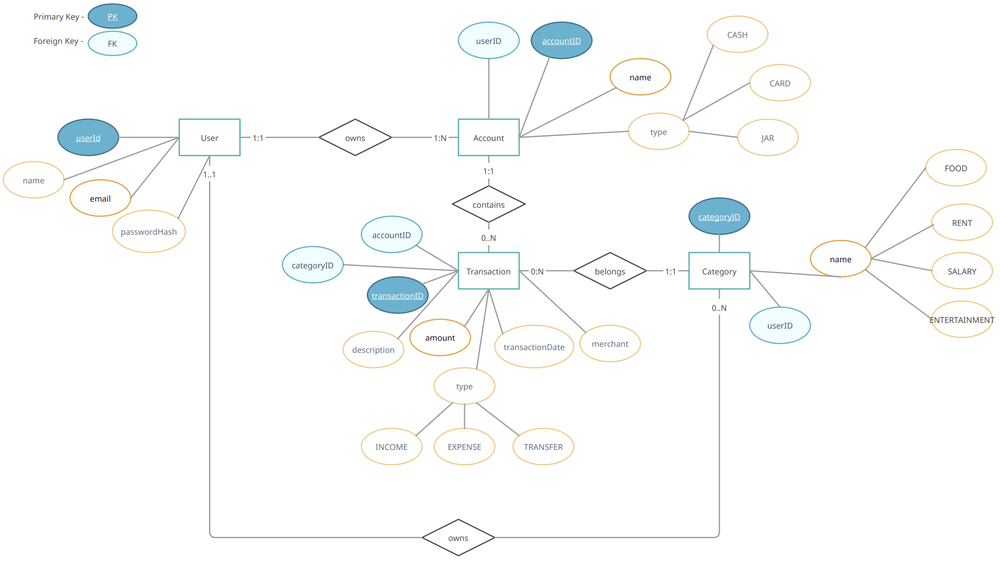

## Personal Finance Tracker API

REST API for a personal finance application built with Java Spring
Boot.

The project is being developed from a set of user stories and a
conceptual data model, followed by API and database design and implementation.

## 1. Planned Functionality

-   User authentication
-   Account management
-   Category management
-   Income and expense tracking
-   Transaction filtering
-   Account balances
-   Total balance
-   Monthly spending summary

## 2. Domain Model

The current domain consists of four main entities:

-   User
-   Account
-   Transaction
-   Category

### Conceptual model:


## 3. Relationships

-   A User can own multiple Accounts.
-   A User can define multiple Categories.
-   An Account can contain multiple Transactions.
-   A Transaction belongs to particular Account and a particular Category.

## 4. Database Model

PostgreSQL currently contains the following tables:

### `users`

  Column            Description
  ----------------- ----------------------
  `id`              Primary key
  `name`            User name
  `email`           Unique email
  `password_hash`   BCrypt password hash

### `accounts`

  Column      Description
  ----------- -------------------------------
  `id`        Primary key
  `user_id`   Foreign key to User
  `name`      Account name, unique per user
  `type`      `BANK`, `CASH` or `JAR`

### `transactions`

  Column               Description
  -------------------- -----------------------------------
  `id`                 Primary key
  `account_id`         Foreign key to Account
  `category_id`        Foreign key to Category
  `amount`             Transaction amount
  `description`        Optional description
  `merchant`           Optional merchant
  `transaction_date`   Transaction date
  `type`               `INCOME`, `EXPENSE` or `TRANSFER`

### `categories`

  Column      Description
  ----------- --------------------------------
  `id`        Primary key
  `user_id`   Foreign key to User
  `name`      Category name, unique per user


## 5. Tech Stack

- Java 21
- Spring Boot
- PostgreSQL
- Spring Data JPA / Hibernate
- Maven

## 6. Architecture

The application follows a layered architecture:

**Controller → Service → Repository → PostgreSQL**

Package Structure

- **Controller** — handles HTTP requests and responses
- **Service** — contains business logic
- **Repository** — handles database access
- **Entity** — represents database data
- **DTO** — defines API user request and response data
- **Exception** — handles application errors
- **Config** — contains application configuration

## 7. Current Status

- User registration
- Password hashing
- Request validation
- Duplicate email handling
- PostgreSQL persistence

## 8. Planned API

### Users

-   [x] `POST /users/register`
-   [ ] `POST /users/login`
-   [ ] `PUT /users/{id}`
-   [ ] `DELETE /users/{id}`

### Accounts

-   [ ] `POST /accounts`
-   [ ] `GET /accounts`
-   [ ] `GET /accounts/{id}`
-   [ ] `PUT /accounts/{id}`
-   [ ] `DELETE /accounts/{id}`
-   [ ] `GET /accounts/balance`

### Transactions

-   [ ] `POST /transactions`
-   [ ] `GET /transactions`
-   [ ] `PUT /transactions/{id}`
-   [ ] `DELETE /transactions/{id}`
-   [ ] Filter by date, category, account, merchant, type and amount
        Ex: `GET /transactions/monthly-summary?month=YYYY-MM`

### Categories

-   [ ] `POST /categories`
-   [ ] `GET /categories`
-   [ ] `GET /categories/{id}`
-   [ ] `PUT /categories/{id}`
-   [ ] `DELETE /categories/{id}`

## 9. Implemented API

### Register user
1. `POST /users/register`

Request:

``` json
{
  "name": "Oleksandr",
  "email": "user@example.com",
  "password": "password123"
}
```

Response:

``` json
{
  "id": 1,
  "name": "Oleksandr",
  "email": "user@example.com"
}
```

A duplicate email returns `409 Conflict`